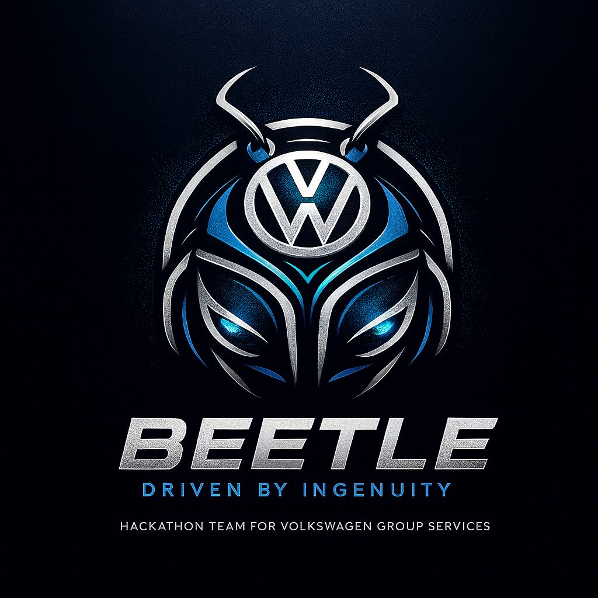

# Beetle Team Solution
# 1. Your Team at a Glance

## Beetle

## Team Members  
| Name  | GitHub Handle | Role(s)                        |
|-------|---------------|--------------------------------|
|Ayowole| Ayowole	    | Generic-Pop Developer          |
|Lais   | laysr         | Mobile Developer & Vibe QA     |
|Gabriel| superze123    | Vibe Architect                 |
|Rui	| patronian     | Final Boss & Backend Developer |
|Ivaldir| ivaldir301    | Whatever-You-Need Developer    |

## Challenge  
Mission: Update Possible Challenge

## Core Idea  

We are developing a platform that receives relevant data on the vehicle, checks eligibility for installing or upgrading apps using their requirements. Then, our platform allows the driver to install or update eligible apps on the vehicle system.

# 2. How Do You Work

## Development Process  

- Talk first, code once.

    We discuss and make decisions before wasting time and effort on the code.

- We will define a raw architecture in a simple diagram before start working on the code.

- We will define functional tests and document them.

## Planning & Tracking  

We will start by defining what technologies and frameworks we want to use.

We will then define goals for each day of the Hackaton and simple tasks and objectives for each part of the initial prototype.

We will divide the workload between the team members depending on their skills.

Our core and initial goal is to get the platform running and if possible have a working app being installed and updated to be a visual real-life example.

Tracking: We will talk throughout the day to check how the tasks are going and where we need reinforcements.

### 1st Day Goals
- All team members should have the tools installed on their laptop (i.e. Symphony);
- Design raw architecture for the project;
- Create tasks and divide between team members.

## Quality Assurance  

We will run high level functional tests and document.

## Communication  

We communicate assertively as a team. Sometimes by mimics and telepathy too.

We also share information through a slack channel.

## Decision Making  

We are a democracy driven by ingenuity.
